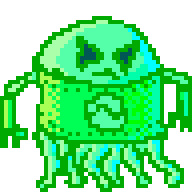

# Welcome to GriNd-O-TRoN!

**General Info:** GriNd-O-TRoN is a game. It's designed to emulate the combat portions of older Japanese-style Role Playing Games (commonly refered to as JRPGs), like Dragon Quest/Warrior or Final Fantasy, which themselves were digital adaptations of pen and paper Role Playing Games like Dungeons & Dragons. GriNd-O-TRoN strips out the often convoluted and confusing story, and just gives you the battles. In GriNd-O-TRoN the action is turn based - you make a move, then you wait for your opponent to make their move, and this series of actions repeat until vistory or defeat.  After the defeat of each foe, experience points are awarded, and when accumulated in sufficient quantity, the player character gains a level and becomes more powerful. This cycle, fighting battles over and over again to become more powerfull, is known as grinding, and is where the app name comes from.

**Strategy:** GriNd-O-TRoN is not a game that can be won with brute force (unless you are exceptionally lucky) - you will need to strategize and learn how to tackle each of the many different enemies your character will be pitted against.  Some baddies will be easier than others, and won't present much of an obstacle even for a begining player. Other enemies will be difficult at first, but becomes managable after gaining a few levels. Some enemies, like the Ninja Master, remain challenging even for more advanced players, and it will be up to you to determine how to face this assembly of beasties. But beware, if you loose all your hit points (health), your character will perish and the game is over...

**Technical Vision:** GriNd-O-TRoN is a React app, hosted on Netlify, using pixel art created with Aseprite. My goals with this project were threefold: I needed to efficiently handle the largest and most complex state object I had worked with to date, I wanted to implement basic principals of object-oriented programming with the combat-engine module itself, and I wanted to experiment with a project that, rather than doing a specific task or having some utility value, was just a fun diversion that would provide a bit of enjoyment for the user.

**Additionaly:** If you enjoy GriNd-O-TRoN, please consider checking out more of my projects here on GitHub, or on http://www.jonforney.com/.  Additionally, I'm currently looking for work, so please feel free to visit my linked in page at https://www.linkedin.com/in/jon-forney/ or contact me directly with your professional opportunies.

